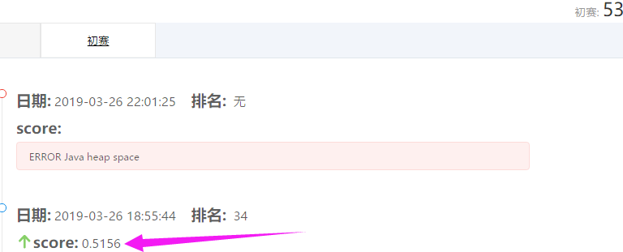
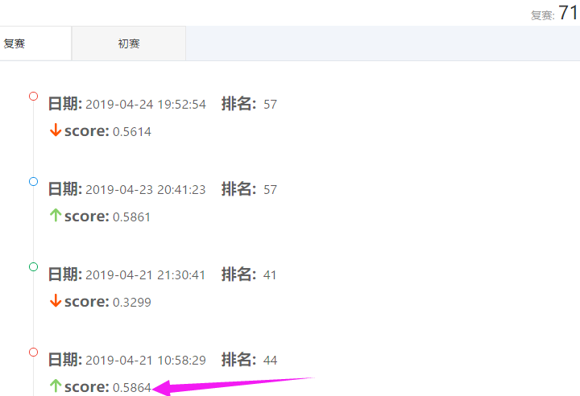

# project5--Monitoring-of-restricted-goods-in-logistics

**Tianchi Competition,** **Tianjin south digital manufacturing algorithm challenge****——****Monitoring of restricted goods in logistics**    

**✧** **（***There were 2,157 teams all over the world*）

**✧** **First season ranking**：**53,  score: **0.5156     **Second** **season ranking**：**71,  score:0.5864**

**Description:** Taking the monitoring of restricted goods in logistics as the subject, the contestants are required to research and develop an efficient computer vision algorithm to monitor whether the images contain dangerous goods and their approximate locations based on the X-ray images and labeling data of the restricted goods given.Through automatic monitoring of package carriers algorithm, reduce the risk of missed inspection and false alarm rate, improve the efficiency of dangerous goods management Main responsible for initial demand analysis and partial programming. 

Ÿ   We tried many backbone and frameworks, like Mmdetection, Deeplabv3, Detectron, Mask RCNN

------

These two folders are two different models that I have used in competitions. One is the pytorch version and the other is based on Google's TensorflowAPI