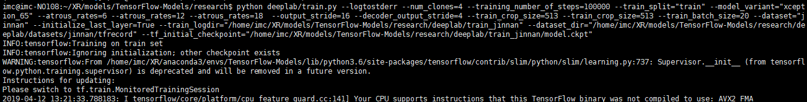
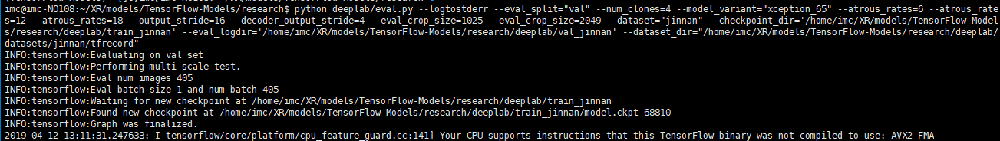

## Step1. training

```
python deeplab/train.py --logtostderr --num_clones=4 --training_number_of_steps=100000 --train_split="train" --model_variant="xception_65" --atrous_rates=6 --atrous_rates=12 --atrous_rates=18  --output_stride=16 --decoder_output_stride=4 --train_crop_size=513 --train_crop_size=513 --train_batch_size=20 --dataset="jinnan" --initialize_last_layer=True --train_logdir="/home/imc/XR/models/TensorFlow-Models/research/deeplab/train_jinnan" --dataset_dir="/home/imc/XR/models/TensorFlow-Models/research/deeplab/datasets/jinnan/tfrecord" --tf_initial_checkpoint="/home/imc/XR/models/TensorFlow-Models/research/deeplab/train_jinnan/model.ckpt"
```



------

## Step2. evaluate

```
python deeplab/eval.py --logtostderr --eval_split="val" --num_clones=4 --model_variant="xception_65" --atrous_rates=6 --atrous_rates=12 --atrous_rates=18 --output_stride=16 --decoder_output_stride=4 --eval_crop_size=1025 --eval_crop_size=2049 --dataset="jinnan" --checkpoint_dir='/home/imc/XR/models/TensorFlow-Models/research/deeplab/train_jinnan' --eval_logdir='/home/imc/XR/models/TensorFlow-Models/research/deeplab/val_jinnan' --dataset_dir="/home/imc/XR/models/TensorFlow-Models/research/deeplab/datasets/jinnan/tfrecord"
```



------

## Step3。 testing

```
python test_jinnan.py
```

## Step4. submit

```
python deeplab/submit_jinnan.py
```

