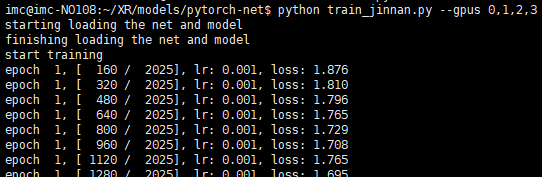
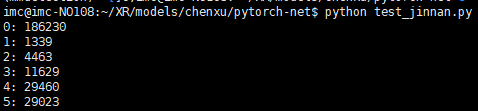

```
python train_jinnan.py --pus 0,1,2,3
```



If you want to start training from a break point **checkpoint**：

for example

```
python train_jinnan.py --pus 0,1,2,3 --resume_from model/epoch_10.pth
```

------

```
python test_jinnan.py
```



